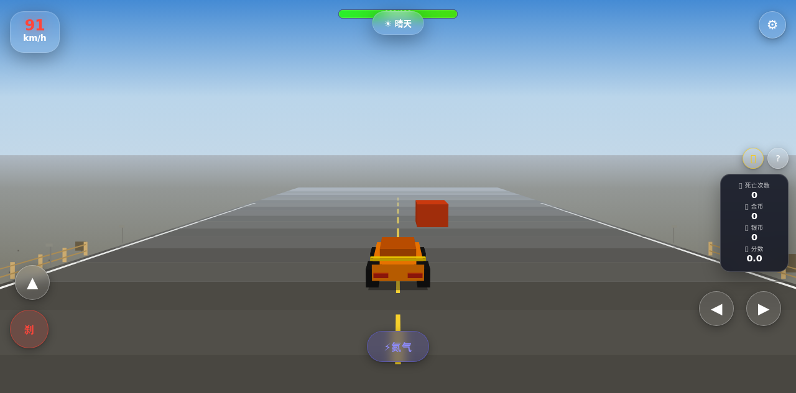
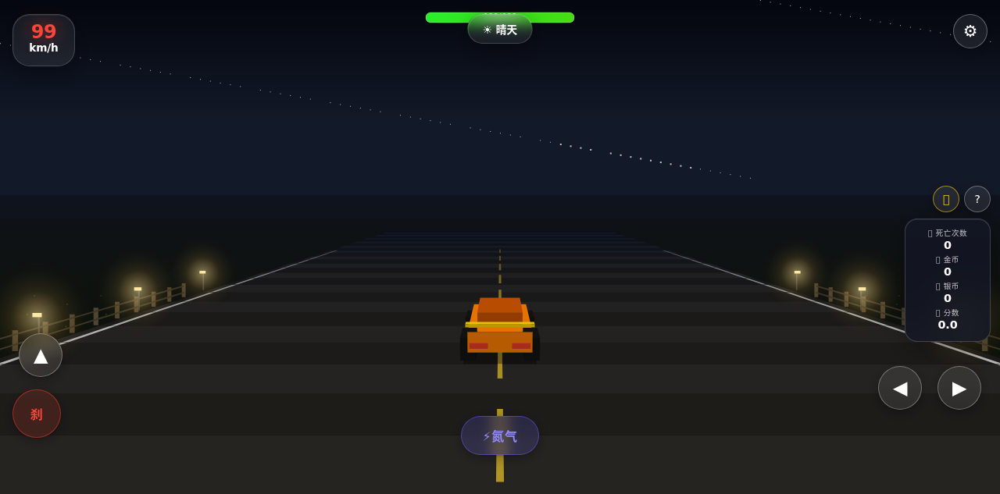
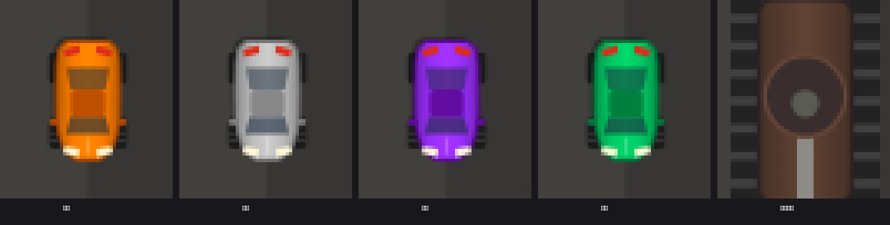

# 漂移赛车 · 真 3D 视角版

一个**单文件 HTML 赛车游戏**（零依赖、零构建、无网络请求），在《漂移赛车模组版 · 极速增强》的基础上重做了渲染管线与车辆模型。

打开 `index.html`（交付副本为 `漂移赛车-3D视角版.html`）即可玩，整个游戏就是一个文件，可以随意拷贝到手机、U 盘或静态服务器。

**3D 视角**




**2D 俯视**



---

## 目录

- [它和原版有什么不同](#它和原版有什么不同)
- [快速开始](#快速开始)
- [操作说明](#操作说明)
- [车辆图鉴](#车辆图鉴)
- [积分与商店](#积分与商店)
- [3D 视角说明](#3d-视角说明)
- [模组系统](#模组系统)
- [技术实现](#技术实现)
- [调试接口](#调试接口)
- [文件结构](#文件结构)
- [已知限制](#已知限制)

---

## 它和原版有什么不同

原版已经有一套很完整的玩法（漂移、氮气、坦克、商店、模组），但视觉与操作上有一些明确的缺陷。这一版针对性做了修复：

| 模块 | 原版状况 | 本版 |
|---|---|---|
| 3D 视角 | 只是把路面画成向一点收敛的梯形，车辆用 `fillRect(W/2, …)` 钉死在屏幕正中；朝 ±x 行驶时所有道路段宽度被算成 0 而全部跳过，屏幕只剩渐变 | 完整**针孔透视管线**，相机跟随车后上方，可自由转向，带雾化与昼夜 |
| 3D 车辆 | 平面色块贴在屏幕中央 | 长方体面片建模（车身/驾驶舱/四轮/尾翼/尾灯），法向量背面剔除 + 定向光照 |
| 2D 车辆 | 两个圆角矩形叠在一起，**轮子画成了圆环**（俯视根本不该是圆） | 流线型车身轮廓 + **长条轮胎** + 三段玻璃 + 前后灯，前轮随车头角速度偏转 |
| 画质 | `canvas.width` 没乘 `devicePixelRatio`，手机上是把 393px 的画布硬拉到 1179 物理像素 | 按设备像素比渲染（上限 2×） |
| 转屏 | `resize` 后道路尺寸不刷新，横竖屏切换会错位 | 同步刷新 + `orientationchange` 补偿 |
| 坦克摇杆 | 摇杆区域**从未绑定任何事件**，永远摇不动 | 完整的指针事件（含 `setPointerCapture`） |
| 退后键 | 与刹车键 CSS 位置**完全重叠**，被刹车键盖住点不到（原作者因此把它隐藏了） | 移到刹车键右侧并排，默认显示 |
| 炮弹 | 初速 **15** 世界单位/秒，比坦克自身（240）还慢 16 倍 | 500 单位/秒，带拖尾、炮声与震屏 |
| 倒车 | 松手后抓地力把速度方向拽向车头，而倒车时速度与车头正好反向 → 车会横着飘 | 按实际行进方向判断目标（车头 / 车尾），直进直退 |
| 3D 坦克 | 履带比车体窄、整条藏在车底；炮塔用的是车体轴向，**只有炮管会动**；炮塔是方块而 2D 是圆 | 两条履带夹住车体；炮塔接 `turretAngle` 整体旋转；新增圆柱函数让炮塔变回圆形 |

---

## 快速开始

1. 把 `漂移赛车-3D视角版.html` 拷到手机或电脑
2. 双击 / 用浏览器打开（`file://` 直接打开即可，不需要服务器）
3. 输入昵称 → 选地图和车型 → 点「开始游戏」

> 手机上建议**横屏**游玩，视野更接近赛车游戏；竖屏也能正常玩。
> 想全屏可以点开始按钮（会在用户手势里尝试 `requestFullscreen` + 锁定横屏）。

---

## 操作说明

### 键盘

| 按键 | 功能 |
|---|---|
| `W` / `↑` | 油门 |
| `S` / `↓` | 倒车 |
| `A` `D` / `←` `→` | 左右转向 |
| `空格` | 刹车（高速+转向 = 漂移） |
| `Shift` | 氮气 |
| `E` | 开炮（仅坦克） |
| `R` | 重生 |

### 触屏

左下角「▲ 油门」「刹 刹车」「倒 倒车」，右下角「◀ ▶ 转向」，底部中间「⚡氮气 / 💣炮弹」。
坦克模式下右下角会出现**炮塔摇杆**（拖动控制炮口方向）。

### 玩法要点

- **漂移**：高速时按住刹车再打方向，会甩尾并获得额外分数
- **氮气**：持续 5 秒，冷却 30 秒；速度越快视野越广（FOV 动态张开）
- **护栏**：车速低于 **60 km/h** 时撞上去会被弹回并掉血；**高于 60 km/h 会直接把护栏撞碎**冲出路外（所以别开太快贴着边线跑）
- **路钉**：车速 ≥ 240 km/h 时前方会刷新三角钉，碾上去扣血并打滑 2 秒（坦克装上尖刺附件后可碾碎）
- **昼夜**：游戏内时间约 2 分钟一轮回，夜晚路灯会亮、车灯照路

---

## 车辆图鉴

| 车型 | 极速 | 加速 | 血量 | 特点 |
|---|---|---|---|---|
| 🟠 **赤焰** | 350 km/h | 1.2× | 100 | 综合均衡 |
| ⚪ **霜刃** | 420 km/h | 1.0× | 100 | 高速 |
| 🟣 **紫电** | 380 km/h | 1.1× | 100 | 全能 |
| 🟢 **碧影** | 500 km/h | 0.9× | 100 | 极速最快，起步慢 |
| 🟤 **铁甲** | 30 km/h | 2.0× | 10000 | **坦克**：摇杆控炮塔、`E` 开炮、可碾碎护栏 |

> 血量低于 50% / 25% 时画面会冒烟并掉加速性能，撞击伤害也会随之放大。

---

## 积分与商店

**积分公式**：每帧 `位移(km) × (当前血量 / 最大血量)`。满血每公里 1 分，残血只有 0.25 分。

每积累 10 分自动兑换 1 金币（开启「实验性功能」则换成银币）。金币通过 `localStorage` 永久保存。

| 道具 | 价格 | 效果 |
|---|---|---|
| 速度加倍 | 10 🪙 | 本局所有车极速翻倍 |
| 导弹威力提升 | 10 🪙 | 炮弹范围与伤害翻倍 |
| 分数双倍收益 | 20 🪙 | 本局积分获取翻倍 |
| 自动修理 | 50 🪙 | **永久**，每 5 秒回 10 点血 |
| 血条翻倍 | 500 🪙 | **永久**，血量上限翻倍（坦克除外） |

---

## 3D 视角说明

点设置面板里的「🎥 3D视角 / 2D俯视」切换，或用 `DriftModAPI.toggle3D()`。

**相机模型**

```
基向量  f = (sinY·cosP, -cosY·cosP, -sinP)     // 前向（含俯仰）
        r = (-cosY, -sinY, 0)                  // 右向
        u = f × r                              // 上向
投影    xc = d·r,  yc = d·f,  zc = d·u         // d = 世界点 − 相机位置
        sx = W/2 + focal·xc/yc
        sy = H/2 − focal·zc/yc
```

- 相机挂在车后上方，`yaw` 平滑跟随车头（约 12%/帧），转向时能看到车身侧面
- `focal` 随速度变化（垂直 FOV 58°→70°，氮气再 +7°），但**地平线位置固定**（由 `pitch` 反向补偿），所以加速时不会有"镜头抬头"的突兀感
- 相机距离随车长自适应：`max(道路半宽 × 0.86, 车长 × 3.2)`，坦克不会被塞满屏幕
- 多边形统一在相机空间做 `yc ≥ near` 裁剪（Sutherland–Hodgman），避免近平面穿插
- 相机"右向量"的符号非常关键——写反会让整个 3D 世界左右镜像

**渲染顺序**

```
天空（渐变 + 星空 + 日月投影）
  → 地面底色（雾色渐变）
  → 地面细节（草点 / 石子 / 带高度的灌木）
  → 道路（分段四边形 + 黄虚线 + 白实线）
  → 护栏 → 路灯
  → 地面特效（轮胎印 / 路钉）
  → 夜间前照灯
  → 世界物体（按深度排序）
  → 玩家车 → 面排序输出
```

**光照**：固定光向量 `(-0.40, -0.48, 0.78)`，面亮度 `0.42 + 0.62·max(0, N·L)`，夜间有亮度下限避免车变成纯黑剪影。

---

## 模组系统

### 启用

设置 →「🧪 实验性功能」→ 打开 →「📂 加载模组」→ 选择 JSON 文件。

> ⚠️ 模组可以执行任意 JS（`init` 字段），只加载你信任的文件。
> 关闭实验性功能会清除所有已加载的模组。

### 模组 JSON 格式

```json
{
  "cars": [
    {
      "name": "我的车", "baseMaxSpeed": 3200,
      "color": "#3a8fd0", "dark": "#22506e", "accent": "#ffd700",
      "accelFactor": 1.1, "isTank": false,
      "hp": 150, "maxHp": 150,
      "image": null,
      "pixelData": null,
      "pixelSize": 6
    }
  ],
  "maps": ["沙漠", "雪原"],
  "obstacles": [
    { "x": 0, "y": 800, "width": 60, "height": 60, "color": "#ff4020",
      "movable": true, "vx": 0, "vy": -40, "breakSpeed": 200, "damage": 30,
      "solid": true, "visible": true, "explode": false }
  ],
  "buttons": [
    { "label": "🚀", "position": { "bottom": "220px", "left": "20px", "width": 56, "height": 56 },
      "action": "dropMine", "mineOptions": { "damage": 500 } }
  ],
  "shopItems": [
    { "id": "superNitro", "name": "超级氮气", "price": 5, "desc": "…", "currency": "silver", "effect": "instantNitro" }
  ],
  "showReverseButton": true,
  "enableTankSpikes": true,
  "weather": "rain",
  "carAccelMultiplier": 1.2,
  "init": "api.setTurnMultiplier(1.3); api.addGold(100);"
}
```

`pixelData` 是二维颜色数组（`[["#f00", null, "#00f"], …]`），可以画像素小车。

`buttons[].action` 可选：`respawn` / `nitro` / `fire` / `zoomIn` / `zoomOut` / `dropMine`。

### DriftModAPI

`init` 字段里可用 `api` 访问（同时挂在 `window.DriftModAPI`）：

```js
// 逻辑接管
setBrakeLogic(fn)  setAccelerationLogic(fn)  setReverseLogic(fn)
set3DRenderLogic(fn)               // 完全接管 3D 渲染
setCarRender(fn)                   // 完全接管车辆绘制
setEngineSound(fn)  setCollisionSound(fn)

// 车辆与状态
getPlayer()  getInput()  getCurrentCarData()  getDeltaTime()
setPlayerHP(hp)  setPlayerScale(sx, sy)  setTurnMultiplier(m)
setCarAccelMultiplier(m)  setWeather('rain'|'fog'|'sunny')
respawn()  activateNitro()  fireShell()  dropMine(opts)

// 世界
addObstacle(ob)  clearObstacles()
setTankSpikesEnabled(v)  setSpikeEnabled(v)

// 相机与资源
getZoom()  setZoom(z)  toggle3D()  showReverseButton(v)
getGold()  getSilver()  addGold(n)  addSilver(n)
```

---

## 技术实现

- **单文件**：HTML + 内联 CSS + 内联 JS，无构建步骤、无外部依赖、无网络请求
- **渲染**：Canvas 2D（不用 WebGL，兼容性最好）
- **坐标系**：世界是 2D 平面 `(x, y)`，`+z` 朝上；车辆朝向角 `a` 的前向是 `(sin a, −cos a)`
- **深度排序**：所有 3D 面按到相机的距离降序绘制（画家算法），车辆与障碍物在同一批次里排序
- **性能取舍**：
  - 投影函数用全局 `_px/_py/_pd` 返回，避免每帧分配上千个临时对象
  - 轮胎印等大量小物件先做距离平方粗筛再投影
  - 标线宽度随深度自适应（否则近处会被透视放大成粗带）
  - `ctx.shadowBlur` 在软件渲染下极慢，只在放大显示 + 夜间/刹车时启用

---

## 调试接口

浏览器控制台里有 `window.__rc`：

```js
__rc.start()                      // 直接开局
__rc.setView(true)                // true=3D / false=2D
__rc.setCar(4)                    // 0-4 切换车型（4 = 坦克）
__rc.setDay(0.5)                  // 0=正午 0.25/0.75=晨昏 0.5=午夜
__rc.zoom(1.6)  __rc.setSteer(0.5)  __rc.freeSteer()
__rc.setKey('up', 1)              // 模拟按键
__rc.addObstacle({ ... })  __rc.addSpike()
__rc.stats()                      // 粒子数 / 转向角 / 炮塔角 / 摇杆 / 炮弹
__rc.camStats()                   // 相机位置、焦距、地平线、距离

window.__profOn = 1               // 开启分段计时（结果在 window.__prof）
```

> `respawn()` 会把缩放重置为 1；`camStats()` 在 `respawn()` 后要等一帧才是新值。

---

## 文件结构

```
DriftRacer3D/
├── index.html                 # 开发中的主文件
├── README.md                  # 本文件
└── preview/                   # 预览图
    ├── 01_白天行驶.png
    ├── 02_漂移转向.png
    ├── 03_夜间路灯.png
    ├── 04_黄昏.png
    ├── 05_3D障碍物.png
    ├── 06_坦克.png
    ├── 07_冲出路面.png
    ├── 08_竖屏手机.png
    ├── 09_横屏.png
    ├── 10_夜间车灯.png
    ├── 11_2D车辆模型.png
    └── 12_默认缩放下的车辆.png
```

交付版本：`漂移赛车-3D视角版.html`（与 `index.html` 内容一致）

---

## 已知限制

- **沙盒/无头环境无法验证真机手感**：帧率、触屏灵敏度、不同浏览器的 Canvas 性能都建议真机实测
- 冲出赛道后路外没有赛道参照物（只有草点与灌木），已加「⚠ 已驶出赛道」+ 方向箭头提示
- 3D 模式下坦克的炮弹飞得较快，低帧率设备上可能不易看清弹道（已加拖尾缓解）
- 高 DPI 渲染上限为 2×，极老设备若掉帧可考虑改小 `DPR` 上限
- 没有任何网络同步功能（纯单机）

---

## 致谢

- 原版《漂移赛车模组版 · 极速增强》作者提供了完整的玩法框架与模组系统
- 本版在其基础上重做了 3D 渲染管线、车辆模型，并修复了若干操作与物理缺陷
